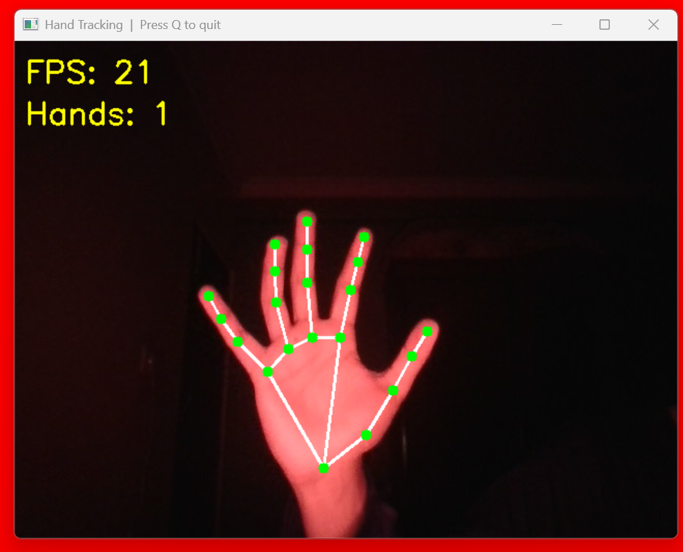

# Hand Tracking

Real-time hand tracking using **OpenCV** and **MediaPipe**.  
Detects up to 2 hands via webcam and draws 21 joint landmarks with a skeleton overlay.

## Demo



---

## Setup & Run

**1. Clone the repo**

```bash
git clone https://github.com/ace32233/hand-tracking-py.git
cd hand-tracking-py
```

**2. Create a virtual environment**

```bash
python -m venv venv
```

**3. Activate it**

Windows:
```bash
venv\Scripts\activate
```

Mac/Linux:
```bash
source venv/bin/activate
```

**4. Install dependencies**

```bash
pip install -r requirements.txt
```

**5. Run**

```bash
python main.py
```

> The model (25MB) will auto download on execution

---

## Requirements

- Python 3.8+
- Webcam
- Internet connection (first run only)
